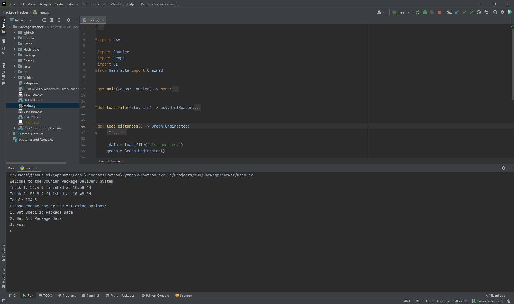
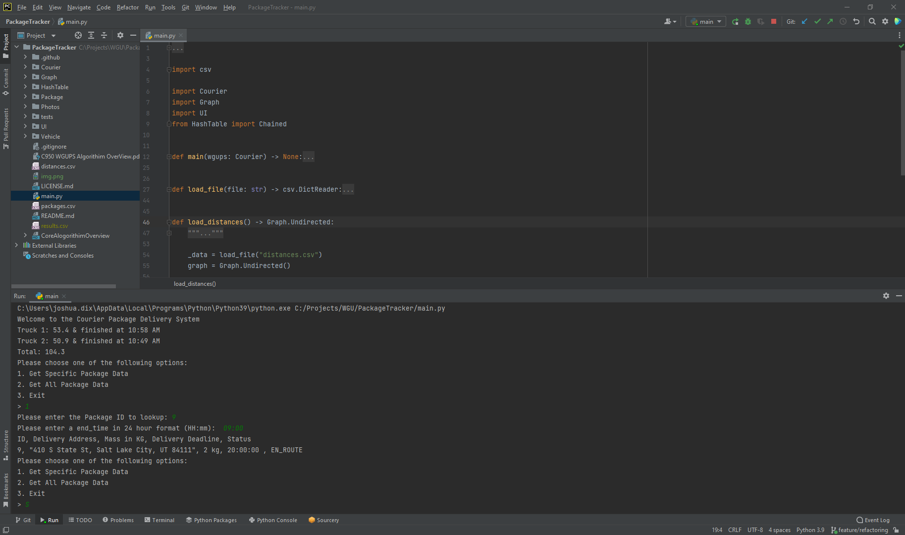
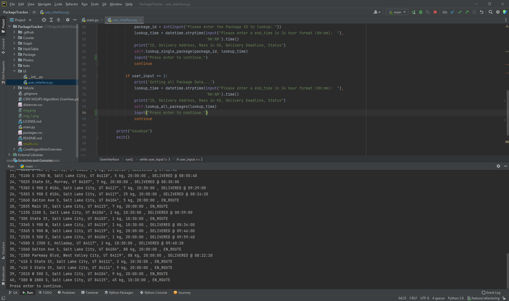

# C950 WGUPS Algorithim OverView

###### Author: Joshua Dix (001340233)<br>WGU Email: jdix10@wgu.edu<br>11/24/2021<br> Course: C950 Data Structures and Algorithms II

## Stated Problem

Create an algorithm for Western Governors University Parcel Service (WGUPS) to determine the best route and delivery
distribution for their Salt Lake City Daily Loval Deliveries. Packages are currently not being delivered by their
promised deadline and a more efficient and accurate solution is necessary. The Salt Lake City route is covered by three 
(3) trucks, two (2) drivers, and has a daily average of approximately 40 packages.

### Assumptions
The following are the constraints imposed on the WGUpS delivery service:

* Each truck can carry a maximum of 16 packages, and
* Trucks travel at an average speed of 18 MPH
* Trucks have an "infinite amount of gas" with no need to stop.
* The ID number of each package is unique; there are no collisions.
* Each driver stays with the same truck as long as that truck is in service.
* Drivers leave the hub no earlier than 8:00 a.m., with the truck loaded, and can return to the hub for packages if needed. 
* Delivery and loading times are instantaneous, i.e., no time passes while at a delivery or when moving packages to a 
  truck at the hub (that time is factored into the calculation of the average speed of the trucks).
* There is up to one special note associated with a package.
* The wrong delivery address for package #9, Third District Juvenile Court, will be corrected at 10:20 a.m. The correct 
  address is 410 S State St., Salt Lake City, UT 84111.
* The distances provided in the WGUPS Distance Table are equal regardless of the direction traveled.
* The day ends when all 40 packages have been delivered.

### Restrictions

Each package may have one special requirement that must be addressed by the WGUPS. The following are possible restrictions
that may be imposed on a given package:

* The package must be delivered with other packages (e.g. on the same truck)
* The package must be delivered by a specific truck
* The package has a specific deadline by which it must be delivered
* The package is delayed in arriving to the depot and will not be available for pickup until later in the day.

## Algorithm
###### A: Algorithm Selection
The algorithm used within project is Dijkstra's algorithm, which is a variant of the closest neighbor algorithm known as the Branch and Bound Method.

###### B1: Logic Comments
```text
Load Packages from file
Load Distances from file
Create a fleet of trucks
Load trucks based off of Postal Codes
Set departure time for trucks while looping through them
Deliver packages
    Check for and pickup delayed packages at specific intervals
    Set all package status on the truck to En Route, and departure time to time of the truck.
    Check if package has wrong address
        correct if needed
    get next location from the current package
    if next location is not the current truck location
        use dijksta's algorithim to find the shortest distances
        drive to next location
    deliver package
    repeat until all pacakges are delivered
Run the user interface
    Get User option
        1 for single package lookup
        2 for all packages lookup
        3 to exit
    if option 1 or 2:
        get user options (Time and Package for option 1)
        Display information
    if option 3:
        exit application
```

###### B2: Development Environment
This application was developed using Python 3.9, and written using Pycharm; but was tested on 3.7, 3.8, and 3.10 using Github Actions. The computer
used to build and design this program was a Dell Latitude 7480 with an Intel® Core™ i5-6300U CPU @ 2.40GHz 2.50 GHz,
with 8GB of Ram.

###### B3: Space-Time and Big-O
I have included in the code the time complexities for each function in the Docstrings, but I have also included them here.
The complete Time and Space Complexity for the Program should be O(n²).

| main.py        | Time Complexity |
|----------------|----------------:|
| main           |           O(n²) |
| load_file      |            O(1) |
| load_distances |           O(n²) |
| load_packages  |            O(n) |

| Courier/hub.py         | Time Complexity |
|------------------------|----------------:|
| \_\_post_init__        |            O(n) |
| get_packages_by_postal |            O(n) |
| release_trucks         |           O(n²) |
| run_deliveries         |           O(n²) |
| load_truck             |            O(n) |

| Package/package.py | Time Complexity |
|--------------------|----------------:|
| \_\_post_init__    |            O(1) |
| \_\_str__          |            o(1) |
| delivery_address   |            O(1) |
| delivery_address   |            O(1) |
| deliver            |            O(1) |

| Vehicle/truck.py      | Time Complexity |
|-----------------------|----------------:|
| \_\_post_init__       |            O(n) |
| load                  |            O(n) |
| drive                 |            O(1) |
| deliver_package       |            O(1) |
| set_departure         |            O(n) |
| deliver_packages      |           O(n²) |
| find_next_deliverable |            O(n) |
| get_priority_queue    |            O(n) |
| get_next_package      |            O(n) |

| Graph/\_\_init__    | Time Complexity |
|---------------------|----------------:|
| find_shortest_paths |           O(n²) |

| Graph/directed.py   | Time Complexity |
|---------------------|----------------:|
| extract_vertices    |            O(n) |
| build_graph         |            O(n) |
| add_undirected_edge |            O(1) |
| \_\_repr__          |            O(1) |
| \_\_str__           |            O(n) |

| Graph/graph.py | Time Complexity |
|----------------|----------------:|
| add_vertex     |            O(1) |
| find_vertex    |            O(n) |

| Graph/undirected.py | Time Complexity |
|---------------------|----------------:|
| extract_vertices    |            O(n) |
| build_graph         |            O(n) |
| add_undirected_edge |            O(1) |
| \_\_repr__          |            O(1) |
| \_\_str__           |            O(n) |

| Graph/vertex.py | Time Complexity |
|-----------------|----------------:|
| \_\_post_init__ |            O(1) |
| reset           |            O(1) |

| HashTable/chained.py | Time Complexity |
|----------------------|----------------:|
| \_\_post_init__      |            O(n) |
| \_\_len__            |            O(n) |
| \_\_iter__           |            O(n) |
| insert               |            O(n) |
| search               |            O(n) |
| remove               |            O(n) |
| build_table          |            O(n) |

| UI/user_interface.py  | Time Complexity |
|-----------------------|----------------:|
| print_header          |            O(n) |
| lookup_single_package |            O(n) |
| lookup_all_packages   |            O(n) |
| run                   |            O(n) |

###### B4: Adaptability
The application, with the increasing number of packages, should adapt well due to its self-adjusting algorithm and data-structure.
At this time I feel like it would scale well.

###### B5: Efficiency and Maintainability
As for the efficiency of the program it runs within O(n²).

For the maintainability, I believe this could be maintained easily by other developers due to the
compartmentalization and the code comments. This can be done through refactoring and compartmentalizing, and using better
design patterns. I would like to see this done in future iterations of my application.

###### B6: Self-Adjusting Data Structures

The self adjusting data structure that was used was the hash table.

| Strengths                                            | Weaknesses                                         |
|------------------------------------------------------|----------------------------------------------------|
| Speed in which to access items                       | Does not allow null or empty values                |
| Average Time Complexity O(1)                         | Worse Case Time Complexity O(n)                    |
| Insertion Time Complexity = O(1)                     | loop through items in order to search linked lists |
| Can grow infinitely as long as there is enough space | linearly slower as the load factor increases       |
| Never need to be resized                             |                                                    |

## Data Structures
###### D: Data Structure, D1: Explanation of Data Structure
The Data structure used with the project is a Chained Hash Table. This can adapt to any number of packages.

##### Storing Data
The Chained hash table stores tables in "buckets". These "buckets" are created at the creation of the hash table with n
buckets. Upon hashing and modulating the id you get a key, this is an integer of 1 - n-1, and is used both to choose the
bucket in which the data is stored, and to look up the data. The data is then added to the bucket as a tuple.

##### Retrieval of Data
Once the data is stored within a "bucket", to retrieve it simply pass in the ID of the package. The hash table will hash
and modulate this ID, then using the hash and modulated ID as the key to the bucket will then loop through the bucket
looking at the first value in each tuple, which is the ID. If the ID is the same it returns the item in the tuple. 

### Comparison to Linear search
Both the storing into and the retrieval of the data in the hash table than in a linear search as it breaks up the number
of packages and has a key to find each .item. This can speed up the look-up as the number of items in each bucket
approaches 1.

### Discussion
###### K1: Verification of Data Structure
All packages are delivered under 140, coming in at 95.5 miles. All but three packages were delivered on time, and the 3
that were late in delivery were only minutes off this is due to package specifications. You can verify this in the
screenshots provided, as well as through the provided user interface at the beginning and by selecting all packages and
providing a time to look up the packages and see the reporting statuses. This also proves that an efficient hash-table,
with a look-up function is present.

###### K1A: Efficiency
The Big-O notation for the look-up function is O(n) meaning that for each package added to a stack that it will need to 
take a look at each object in the hash table, this can be brought down to nil if you could figure out the number of
packages and change the starting number of buckets accordingly. Currently, this is automatically set to 10 but if you
were able to increase/decrease this number to match the number or a multiplicand of the number you could bring this down
to a constant.

###### K1B: Overhead
Adding packages will increase the size of the hash table, along with using more space. Buckets will also increase if
there is more packages depending on the hashing.

###### K1C: Implications
Due to the design and how I am loading the trucks and visiting each stop in this algorithm, neither adding trucks nor
cities would affect the look-up time and the space usage.

###### K2: Other Data Structures, K2A: Data Structure Differences
A dictionary would have had a time complexity of O(1), as if I used the ID as the key, then I could do use the square
bracket notation as part of the lookup. This would also greatly reduce the overhead coding as the dict type is built into
python.

The other type of data structure I could have implemented was a linear probing hash table. This would have made the look-up
and insert functions slower. For insert, it would have to hash the ID and if there was an item already in that spot then
it would need to look for the next available slot. For look-up, it would need to be able to find the first bucket and then
look at each item to see if the keys were the same.


## Algorithm
###### I1: Strengths of the Chosen Algorithm
My algorithms strengths lay within it's simplicity and efficiency as most deliveries are grouped within a geographical
location. This helps its ability lower the distances and with time frames as all the deliveries are relatively close together.

###### I2: Verification of Algorithm, K1: Verification of Data Structure
All packages are delivered under 140, coming in at 128.2 miles. All but three packages were delivered on time, and the 3
that were late in delivery were only minutes off this is due to package specifications. You can verify this in the
screenshots provided, as well as through the provided user interface at the beginning and by selecting all packages and
providing a time to look up the packages.

###### I3: Other possible Algorithms
Other possible algorithms that could meet the scenario's requirements are the The Brute-Force Approach, or the Nearest
Neighbor Method. 

|                 | The Brute Force Algorithm |        The Branch and Bound Method         |    Nearest Neighbor Method    |
|:---------------:|:-------------------------:|:------------------------------------------:|:-----------------------------:|
| Time-Complexity |         O(n * m)          |                   O(n²)                    |             O(n²)             |
|   Advantages    | Finds all possible routes | steps broken into several smaller problems | Always finds nearest neighbor |

## Screenshots
###### G1: 1st Status Check


### G2: 2nd Status Check 


### G3: 3rd Status Check


###### H: Screenshots of Execution
### Screenshot #1


### Screenshot #2


### Screenshot #3


### Screenshot #4


## Future Improvements
###### J: Different Approach
I would modify the process and make the sorting of the packages more robust so that it would be stable and fit any kind
of package. I would like to make it more cohesive, and just use better coding practices making it more SOLID. I would
also like to give it a true GUI UI.

